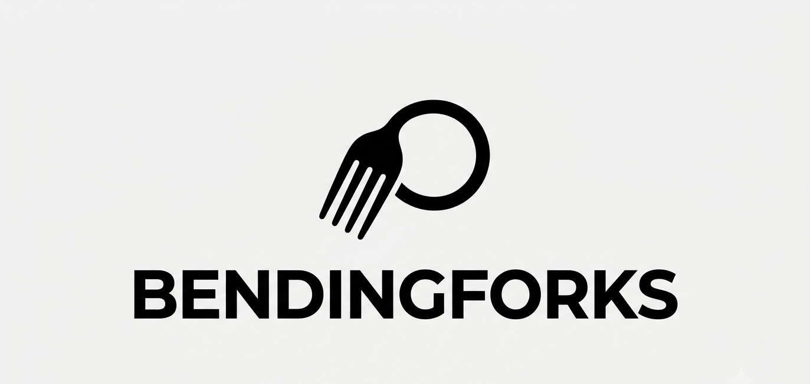

# BendingForks



Project simulation for Project Management course

## Resources

Look in folder `resources` for the course slide decks.
In `graphify-out/GRAPH_REPORT.md` you can find a graph report.

It's possible to view the graph in a web browser by opening `graphify-out/graph.html`.

## AI Agent Setup

### Team Workflow & Roles

This project is a university exam simulation divided among 4 students. The repository is shared, but each team member is responsible for a different workstream (Infrastructure, ECM, AI, Adoption). 
To ensure AI agents assist you only with your specific workload without interfering with others:
1. Create a `.user_role.md` file in the root of the project (this file is ignored by Git).
2. Write down your specific role and workstream (e.g., "I am responsible exclusively for the AI Modules").
3. Agents will automatically read this file to tailor their assistance to your specific deliverables.

### Required Skills

To interact correctly with this repository using an AI Agent, ensure you have the following skills and plugins configured:

- **[Notion CLI (ntn) Skill](https://github.com/g-mainardi/notion-cli-skill)**: Required to sync and interact with the project's single source of truth on Notion.
  - Install the skill via: `agy plugin install https://github.com/g-mainardi/notion-cli-skill`
  - *(Note: The official `ntn` CLI tool must also be installed in your terminal. Get it from [ntn.dev](https://ntn.dev) or install via `curl -fsSL https://ntn.dev | bash`)*.
  - **Setup**: In the project root, create a `.env` file and add your Notion API token in this format: `export NOTION_API_TOKEN="your_token_here"`.
    Use the token for the Notion workspace/page where this project is hosted. The `ntn` CLI reads this variable to authenticate and access Notion.
- **[Graphify Skill](https://github.com/Graphify-Labs/graphify)**: Required to query codebase relationships and project resources via knowledge graphs.
  - Install via: `agy skill install https://github.com/Graphify-Labs/graphify`
- **[Humanizer Skill](https://github.com/blader/humanizer)**: Required to refine and humanize AI-generated text outputs.
  - Install via: `agy plugin install https://github.com/blader/humanizer`

### MCP Servers

- **NotebookLM MCP Server**: Required to query the academic course materials (e.g., the "Project Management - PDF+Registrazioni" notebook) to theoretically justify PM choices in the documentation.
  - Setup instructions:

    ```bash
    # 1. Install the community package using uv (recommended for Python tools) or pipx
    uv tool install notebooklm-mcp-cli
    
    # 2. Authenticate to extract the necessary session cookies from your browser
    nlm login
    
    # 3. Register the MCP server in Antigravity's global configuration
    # Edit or create the ~/.gemini/config/mcp_config.json file with
    {
        "mcpServers": {
            "notebooklm": {
            "command": "notebooklm-mcp",
            "args": []
            }
        }
    }
    ```
